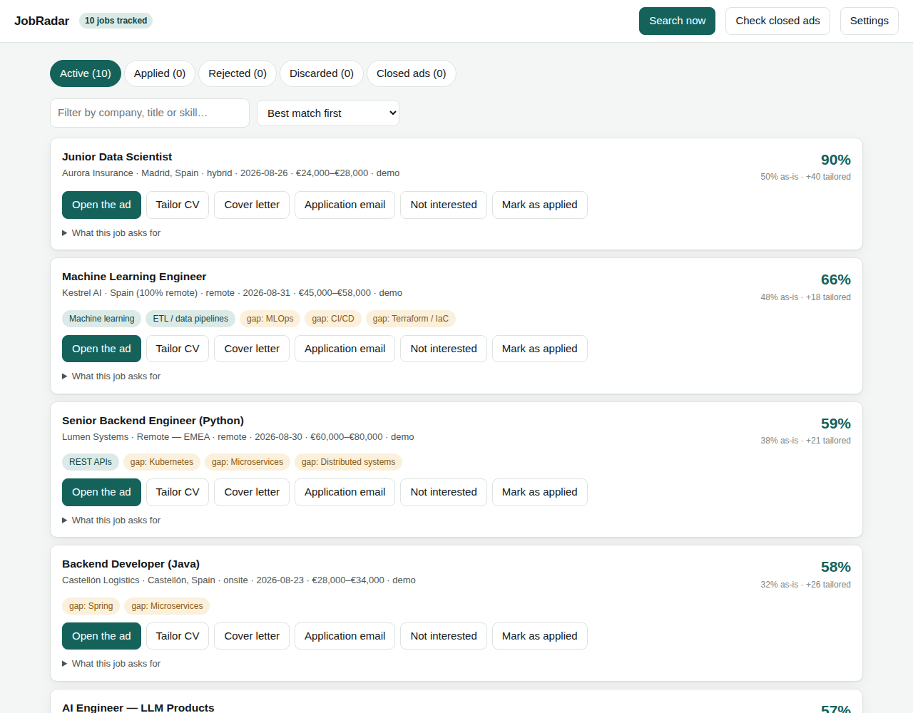
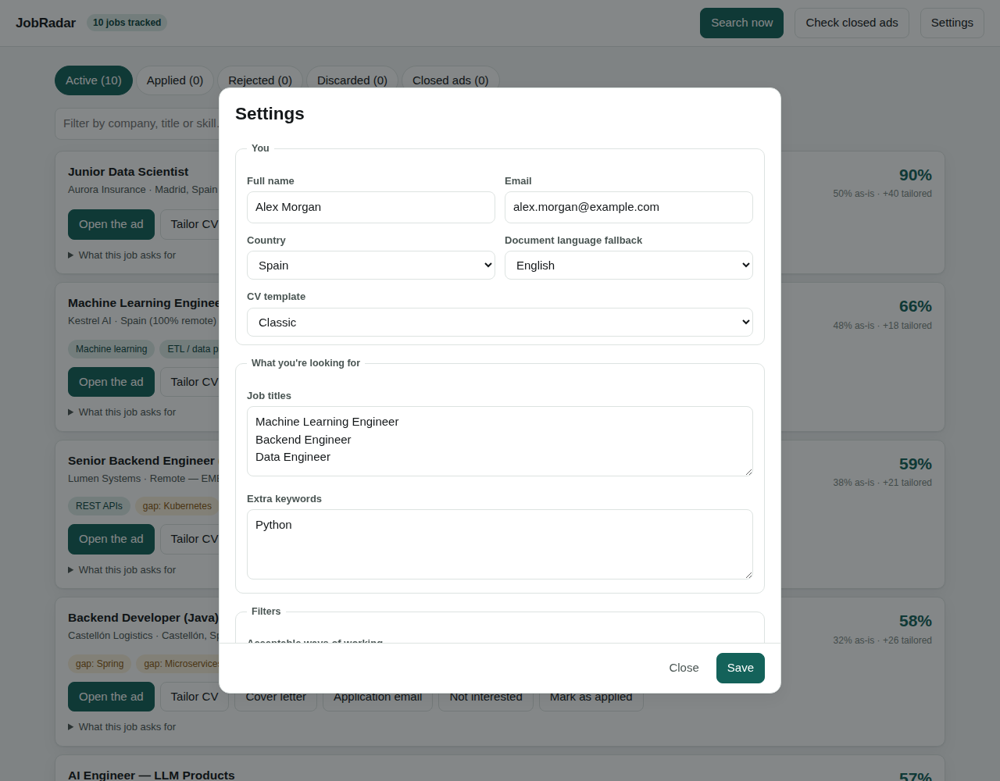

# JobRadar

**A self-hosted job radar that searches job boards, scores every opening against your CV, and writes a tailored one-page CV for each one — without inventing a single thing about you.**

JobRadar runs on your machine, keeps your CV and your job search in a local SQLite file, and works with or without a language model. It is not tied to any industry: the profile, the filters, the skill taxonomy and the salary tables are all data you can edit.

```bash
pip install -e ".[all]"
playwright install chromium     # only needed for PDF output
jobradar demo                   # synthetic data, no network calls
jobradar serve                  # dashboard on http://127.0.0.1:8000
```



---

## Contents

- [What it does](#what-it-does)
- [Why the CV part is different](#why-the-cv-part-is-different)
- [Install](#install)
- [Quick start](#quick-start)
- [The dashboard](#the-dashboard)
- [Command line](#command-line)
- [Configuration](#configuration)
- [Job sources](#job-sources)
- [Using a language model (optional)](#using-a-language-model-optional)
- [Running it on a schedule](#running-it-on-a-schedule)
- [Repository layout](#repository-layout)
- [Privacy and data](#privacy-and-data)
- [Limitations, honestly](#limitations-honestly)
- [Contributing](#contributing)
- [Licence](#licence)

---

## What it does

**1. Searches.** Every enabled source is queried for your target job titles. Public APIs and feeds are on by default; national boards that need care are opt-in (see [Job sources](#job-sources)). You can also list companies to watch — give it `stripe.com` and it works out which hiring system that company uses and reads its job board directly.

**2. Deduplicates.** The same opening appears on three boards at once and once more through an agency. Duplicates are collapsed on the job id, on a normalised company-and-title fingerprint, and on token overlap in the title — never on substring matching, which is how a radar decides you know *Alan* because the company is called *Talan*.

**3. Reads the fine print.** Each ad is fetched in full and re-read: work mode (an ad that says "remote" three times and then mentions two office days is hybrid), which countries a remote role may actually be performed from, minimum years of experience, and any published salary.

**4. Filters.** Work mode, geography, salary floor with live currency conversion, seniority, recency, keywords, blocked companies. Missing information is never treated as a rejection: a job with an unclear remote scope is kept and flagged, because the alternative is losing good jobs to bad metadata. Every rejection carries a reason, and `jobradar search --explain` shows you the tally — which is how you find the one filter that is quietly eating everything.

**5. Prices.** Around two thirds of ads publish no salary. JobRadar estimates a band from an editable reference table adjusted for the country, always marks it as an estimate, and shows the reasoning.

**6. Scores.** Each job gets two scores: what your CV proves *today*, and what it would prove if the relevant skills were pulled out of your skills list and into an achievement. The difference is what tailoring is worth. Gaps are listed explicitly, worst first.

**7. Tailors.** For any job, JobRadar writes a headline and a professional summary, reorders your achievements by relevance, reorders your skill groups, and renders a one-page PDF — shrinking the type in small steps until it fits rather than cutting your content.

**8. Checks.** Every generated document is validated against your profile, and every CV is linted for the things a senior recruiter spots in ten seconds.

**9. Tracks.** Active, applied, rejected, discarded — with stages, dates and notes. *Discarded* (you passed) and *rejected* (they passed) are kept distinct, because merging them destroys your response-rate statistics. Applications are never submitted for you: the button opens the ad.

---

## Why the CV part is different

Most CV tools optimise for a keyword match. That produces a CV you cannot defend in an interview, which is worse than no CV at all.

JobRadar has three mechanisms to stop that, and they are the reason the project exists.

### 1. Evidence and ceilings

Each skill in your profile carries two numbers:

| | Meaning |
|---|---|
| **Evidence** | How strongly your CV proves it *today*. `1.0` = argued for inside an achievement with a result attached. `0.5` = listed in a skills section. `0.0` = you do not have it. |
| **Ceiling** | How far a tailored CV may push it — that is, how well you could defend it under twenty minutes of questioning. |

A tailored CV can raise a skill from its evidence to its ceiling by moving it into a bullet or the summary. **A skill with evidence `0.0` has no ceiling and never rises.** That single rule is the lock: no amount of tailoring can invent experience, so the improvement in the score always reflects better presentation of things that are already true.

Both numbers are proposed automatically when your CV is imported and are editable in the dashboard, because only you know which of your listed tools you could survive a technical interview on.

### 2. Your achievements are never rewritten

The tailoring step reorders achievements within a position. It does not rewrite them, merge them, move them between jobs, or reorder the positions themselves. Your bullets are written once, in your own words, and the CV that gets you the call says exactly what your profile says.

Achievements follow Google's XYZ formula — *accomplished **X**, as measured by **Y**, by doing **Z*** — and the linter tells you which of yours are missing the Y.

### 3. Everything generated is verified

Generated text is compared mechanically against your profile before it reaches a PDF:

- **Invented skills** — a technology named in the document that your profile has no evidence for. Rejected.
- **Invented figures** — a number that appears nowhere in your profile. Models are fond of rounding 47% up to 50%. Rejected.
- **Inflated seniority** — more years claimed than your own dates support. Rejected.

When a draft fails, JobRadar keeps the deterministic version and tells you what was rejected and why. The check runs whether or not a language model was involved.

### 4. The red-flag linter

`jobradar lint` reports what a reader will notice in the first pass:

<details>
<summary>The full rule list</summary>

| Rule | Severity | What it catches |
|---|---|---|
| `too-long` | error | More than one page |
| `missing-name`, `missing-email` | error | No way to contact you |
| `missing-dates` | error | An undated position |
| `chronology` | error | Positions not in reverse-chronological order |
| `no-achievements` | error | A CV of job titles with nothing under them |
| `employment-gap` | warning | An unexplained gap over five months |
| `few-metrics` | warning | Fewer than half the achievements carry a number |
| `duty-language` | warning | "Responsible for…", "Worked on…" |
| `long-bullet` | warning | An achievement over 300 characters |
| `empty-phrase` | warning | "Results-driven", "team player", "detail-oriented" |
| `skill-stuffing` | warning | More than 40 listed skills |
| `acronym-soup` | warning | A summary that is mostly acronyms |
| `no-summary`, `long-summary` | warning | No summary, or one nobody will read |
| `thin-contact` | warning | Email only, no phone or LinkedIn |
| `too-many-bullets` | info | More than six achievements in one role |
| `mixed-tense` | info | "-ing" and past-tense openings in the same role |
| `first-person` | info | Bullets starting with "I" |
| `orphan-skills` | info | Many skills listed but never demonstrated |
| `repeated-keyword` | info | The same term repeated for ATS ranking that does not work |
| `summary-without-evidence` | info | A summary with no concrete figure |

Rules that would encode a cultural preference are deliberately absent. Whether a CV should carry a photo or a date of birth varies enormously by country, and a linter that flags a German CV for following German convention is worse than no linter.
</details>

### 5. The output survives an ATS

Every template is a single column of real, selectable text, in a standard font, with nothing in the page margins — no tables, no sidebars, no icons, no text inside images. Those are the four things that make a CV come out of an applicant tracking system scrambled.

---

## Install

Requires Python 3.10 or newer.

```bash
git clone https://github.com/your-username/jobradar.git
cd jobradar
python -m venv .venv && source .venv/bin/activate    # Windows: .venv\Scripts\activate
pip install -e ".[all]"
playwright install chromium
```

Or install only what you need:

```bash
pip install -e .                # search, filter, score, dashboard, HTML CVs
pip install -e ".[pdf]"         # + PDF rendering (headless Chromium)
pip install -e ".[parse]"       # + importing a PDF or DOCX CV
pip install -e ".[excel]"       # + .xlsx export
```

`jobradar doctor` tells you what is installed and what each missing piece would give you.

---

## Quick start

### Look around first

```bash
jobradar demo      # a synthetic profile and ten synthetic jobs; no network
jobradar serve
```

The demo jobs are chosen to exercise the interesting cases: a US-only "remote" role, an EMEA one, an agency posting that hides its client, an ad with no salary, and an on-site job outside your areas.

### Set it up for yourself

Either open the dashboard and let the wizard walk you through it:

```bash
jobradar serve      # the setup wizard opens on first run
```

…or do it from the terminal:

```bash
jobradar init --cv ~/Documents/my-cv.pdf
jobradar search --explain
jobradar tailor --top 5
jobradar serve
```

---

## The dashboard

`jobradar serve` starts a local page on `http://127.0.0.1:8000`.

**First run** collects, in order: who you are and where you work from; your CV (upload or paste); the job titles you are looking for; your filters; and which sources to search. All of it is saved and never asked again — the same values are editable afterwards under **Settings**.

**The board** has five tabs — Active, Applied, Rejected, Discarded and Closed ads — with a search box and sorting by match, date or salary. Each job shows both scores, your strongest overlaps, your genuine gaps, the salary with its provenance, and anything you should clarify before applying.

**Per job**, four buttons: open the ad, tailor the CV, write a cover letter, write the application email. Letters are written on demand, one job at a time, because writing them for every job found is the slowest and most expensive part of any job-search automation and you want them for a handful of jobs.

**Settings** covers everything: your details, target titles, every filter, which sources run, the language-model provider, and — most usefully — the evidence and ceiling for each of your skills.



---

## Command line

| Command | What it does |
|---|---|
| `jobradar init [--cv FILE] [--config FILE]` | Set up, interactively or from YAML |
| `jobradar demo` | Load the synthetic dataset |
| `jobradar search [--explain] [--no-llm] [--notify]` | Run the pipeline |
| `jobradar sweep [--limit N]` | Retire ads that have closed |
| `jobradar tailor [JOB_ID] [--top N]` | Generate tailored CVs |
| `jobradar lint` | Run the red-flag check on your profile |
| `jobradar jobs [--status ...] [--all]` | List the pipeline |
| `jobradar export [--format csv\|excel]` | Export everything, including your notes |
| `jobradar notify [--dry-run]` | Send the digest of new jobs |
| `jobradar sources` | Show every source and whether it is on |
| `jobradar serve [--host --port]` | Start the dashboard |
| `jobradar doctor` | Check the installation |

Global flags: `--home DIR` (where the data lives, default `./data`) and `-v` for logging.

---

## Configuration

Everything is stored in `data/jobradar.sqlite3` and edited from the dashboard or `jobradar init`. For unattended installs, `jobradar init --config settings.yaml` loads it from a file instead. Full reference: **[docs/CONFIGURATION.md](docs/CONFIGURATION.md)**.

The filters, briefly:

| Setting | Effect |
|---|---|
| `work_modes` | Which of remote / hybrid / on-site you will take |
| `local_areas` | Places where hybrid and on-site are fine anyway — this is how "remote anywhere, plus an office job in my own city" is expressed |
| `home_country`, `eligible_countries` | Where you may legally be employed |
| `allow_international_remote` | Accept remote roles from abroad when the ad actually permits it |
| `min_salary`, `salary_currency` | The floor, applied after conversion at ECB rates |
| `require_published_salary` | Drop anything whose salary is only an estimate |
| `max_years_experience` | Skip ads demanding more than you have |
| `required_keywords`, `excluded_keywords`, `excluded_companies` | The usual |
| `max_age_days`, `keep_undated` | Freshness |

Two data files are meant to be edited:

- **`src/jobradar/resources/skills.yaml`** — the skill taxonomy. Cross-industry, but if your field is not covered, add your keys here and everything downstream picks them up.
- **`src/jobradar/resources/salary_bands.yaml`** — reference salary bands by role family, seniority and country. Deliberately conservative; treat them as a starting point for your market, not as data.

Secrets live in `.env` (copy `.env.example`) and are never written to the database.

---

## Job sources

Run `jobradar sources` to see the current state. Each adapter declares a tier:

| Tier | Meaning | Default |
|---|---|---|
| **open** | A documented public API or feed intended for programmatic use | On |
| **credentials** | A public API needing a free key you obtain yourself | On once the key is set |
| **restricted** | Reached by parsing pages built for human visitors | **Off** |

Shipped adapters:

| Source | Tier | Notes |
|---|---|---|
| RemoteOK | open | Public JSON feed, remote-only |
| We Work Remotely | open | Category RSS. Its "Anywhere in the World" tag is unreliable, so the ad body always wins |
| Himalayas | open | Publishes structured geographic restrictions — the field that decides whether an international remote job is real for you |
| Arbeitnow | open | Free documented API, strong in the German-speaking market |
| Company career boards | open | Greenhouse, Lever, Ashby, Workable, Recruitee, SmartRecruiters, Personio — auto-detected from a domain |
| Adzuna | credentials | ~20 countries, indexes local boards. [Free key](https://developer.adzuna.com/) |
| Jooble | credentials | Worldwide. [Free key](https://jooble.org/api/about) |
| LinkedIn (guest endpoint) | restricted | Highest volume by a distance |
| InfoJobs (Spain) | restricted | Publishes salary, minimum years and required skills |
| Tecnoempleo (Spain) | restricted | Tech-only, labels work mode in the listing |

**About the restricted tier.** These read pages that were built for people, not programs, and the sites' terms may not permit automated access. They are off unless you switch them on by name, having read the warning the dashboard shows. Whether that is acceptable is a decision for the person running the software, under their own jurisdiction and the site's terms — not a default this project should make for you. If you enable one, keep the request delay generous, leave `respect_robots` on, and use it at the volume of a person doing their own job search.

**The polite defaults apply to every source**: one request per second per host, `robots.txt` honoured, responses cached for an hour, exponential backoff on 429, and a user agent that says what the software is.

Adding a source is one file and one registry line — see **[docs/SOURCES.md](docs/SOURCES.md)**.

---

## Using a language model (optional)

Everything works without one. With `provider = "none"` JobRadar reads ads with a keyword taxonomy, writes summaries from a template filled with your own material, and produces letter skeletons with the parts that need a human marked in brackets.

A model improves four things: reading an ambiguous ad, importing a CV into a structured profile, writing the tailored summary, and writing letters. It is spoken to over plain HTTP, so enabling it adds no Python dependency.

```bash
JOBRADAR_LLM_PROVIDER=anthropic          # or openai, openai-compatible, ollama
JOBRADAR_LLM_MODEL=claude-sonnet-4-5
ANTHROPIC_API_KEY=...
```

`ollama` and `openai-compatible` point at a local server, so you can run the whole thing offline. `max_calls_per_run` caps the spend of an unattended run; `jobradar search --no-llm` forces the deterministic path for one run.

Whatever the model writes still goes through the validator. A draft that invents anything is discarded, not shipped.

---

## Running it on a schedule

The point of a scheduled search is not having to check anything, so it only works if the run can reach you. Configure a digest (email or Telegram) in `.env`, enable it in Settings, and run:

```bash
jobradar sweep && jobradar search --notify
```

Nothing is sent when there is nothing new — a daily "0 new jobs" message is one you learn to ignore, and then you miss the one that matters. Recipes for cron, systemd, Windows Task Scheduler and GitHub Actions are in **[docs/SCHEDULING.md](docs/SCHEDULING.md)**.

---

## Repository layout

```
src/jobradar/
├── models.py            Shared data structures
├── config.py            Settings, filters, filesystem layout
├── storage.py           SQLite persistence
├── taxonomy.py          The skill vocabulary
├── textutils.py         Reading facts out of ad text, no model needed
├── sources/             One file per job board
│   ├── base.py          The plugin contract + the polite HTTP client
│   └── optional/        Opt-in adapters, off by default
├── pipeline/            search · dedupe · filters · salary · scoring · sweep
├── profile/             CV import, evidence and ceiling derivation
├── documents/           Tailoring, rendering, letters, the validator
│   └── templates/       CV templates (single column, ATS-safe)
├── lint/                The recruiter red-flag rules
├── llm/                 Provider-agnostic client and every prompt
├── web/                 FastAPI dashboard, one self-contained page
├── exporters/           CSV and Excel
├── notify/              Email and Telegram digests
└── resources/           skills.yaml · countries.yaml · salary_bands.yaml · demo data
```

**[docs/ARCHITECTURE.md](docs/ARCHITECTURE.md)** explains why the pipeline is ordered the way it is and where to hook in.

---

## Privacy and data

- Everything lives in `data/`, which is git-ignored. Your CV, contact details and job-search history never leave your machine.
- The dashboard binds to `127.0.0.1`. Exposing it takes an explicit `--host`, and you should think before doing so.
- The page loads no external assets — no CDN, no fonts, no analytics. It works offline.
- Outbound requests go to the job boards you enabled, the ECB (for exchange rates) and your language-model provider if you configured one. Nothing else.
- API keys are read from the environment and are never written to the database or included in an export.

---

## Limitations, honestly

- **Your CV's layout is not reproduced pixel for pixel.** Its *content* is imported into a structured profile and re-rendered with a template. That is the trade: a structured profile can be tailored, scored and validated per job; a pixel-perfect copy can only be reprinted. Anything claiming otherwise from an arbitrary PDF is overselling.
- **Importing without a language model is approximate.** The heuristic parser finds your contact details, sections, positions and bullets, and gets dates roughly right. Review it before generating anything — the dashboard tells you exactly this after an import.
- **Salary estimates are estimates.** They come from an editable table, not from market data. They are always labelled.
- **Restricted sources can break.** They read pages that change without notice. That is part of why they are opt-in.
- **The score is a triage aid, not a verdict.** It measures overlap between an ad's stated requirements and your evidenced skills. It knows nothing about whether you would enjoy the job.

---

## Contributing

New source adapters, taxonomy entries for under-covered fields, salary bands for more countries, CV templates and linter rules are all welcome. **[CONTRIBUTING.md](CONTRIBUTING.md)** has the details; the test suite is fully offline, so `pytest` needs no network and no keys.

## Licence

MIT — see [LICENSE](LICENSE).
