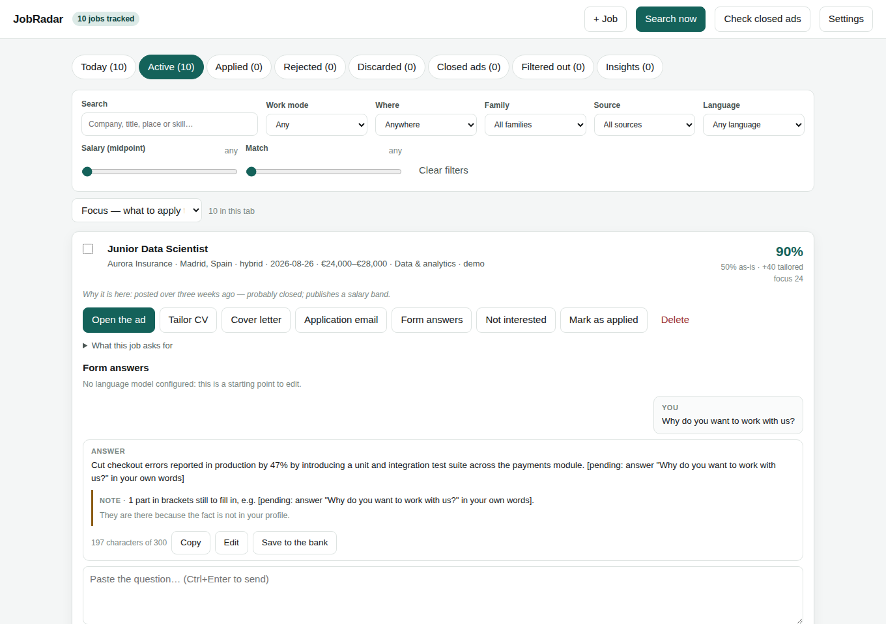

# JobRadar

**A self-hosted job radar for any kind of work: it searches job boards, scores every opening against your CV, and writes a tailored one-page CV for each one — without inventing a single thing about you.**

JobRadar runs on your machine, keeps your CV and your job search in a local SQLite file, and works with or without a language model. It is not tied to any industry: the profile, the filters, the skills, the job families and the salary tables are all data you can edit.

```bash
pip install -e ".[all]"
jobradar demo      # synthetic data, no network calls
jobradar serve     # dashboard on http://127.0.0.1:8000
```


---

## Contents

- [What it does](#what-it-does)
- [Why the CV part is different](#why-the-cv-part-is-different)
- [Install](#install)
- [Quick start](#quick-start)
- [The dashboard](#the-dashboard)
- [Command line](#command-line)
- [Configuration](#configuration)
- [Job sources](#job-sources)
- [Using a language model (optional)](#using-a-language-model-optional)
- [Running it on a schedule](#running-it-on-a-schedule)
- [Repository layout](#repository-layout)
- [Privacy and data](#privacy-and-data)
- [Limitations, honestly](#limitations-honestly)
- [Contributing and licence](#contributing-and-licence)

---

## What it does

1. **Searches** every enabled source for your target job titles — public APIs and feeds by default, national boards opt-in, and the job boards of companies you name (`stripe.com` is enough).
2. **Deduplicates** the same opening seen on several boards, by id, by a company-and-title fingerprint and by title overlap — never by substring.
3. **Reads the fine print** of each ad: the real work mode, which countries a remote role accepts, years of experience asked for, any published salary.
4. **Filters** on work mode, geography, salary floor (with live currency conversion), years, freshness, keywords and companies. Missing information never rejects a job, and **nothing rejected is thrown away**: *Filtered out* shows every dropped ad with its reason, and which filter is doing the damage.
5. **Sorts and prices.** Every job gets a **job family** (healthcare, logistics, hospitality, software and twenty more — editable, with a priority each). Ads without a salary get an estimate from the family's band, adjusted for the kind of employer, the hiring country and signals in the ad; always labelled as an estimate.
6. **Scores and triages.** Two scores — what your CV proves today, and what it proves once tailored — plus your gaps, each marked with how long it would take to close. The board is ordered by **focus**: the match less what is known to go nowhere (stale ads, titles above your years). **Today** shows the six jobs to start with.
7. **Tailors and writes.** A one-page CV per job (headline, summary, achievement and skill order), with an optional **CV per job family**; cover letters and emails, editable and downloadable as PDF; and **answers to application-form questions** within the form's limit, with a bank of your best answers to reuse.
8. **Checks** every generated CV against your profile and lints it for what a recruiter spots in ten seconds. Letters, emails and answers get warnings (figures you cannot back, template phrases, a company never named…) that never block you.
9. **Tracks** active, applied, rejected and discarded jobs with stages, dates and notes. Add a job you found elsewhere with **+ Job**; delete one for good (with a week to undo). Applications are never sent for you.
10. **Reads your replies** (optional, read-only IMAP): each reply is matched to its application as a rejection, a next step or an automatic acknowledgement, and a proposed interview becomes a calendar file.
11. **Says whether it is working.** *Insights* shows replies by source, family and match score, and each source's record over past runs.

---

## Why the CV part is different

Most CV tools optimise for a keyword match, which produces a CV you cannot defend in an interview. JobRadar is built around the opposite rule: **tailoring may change which true things are prominent, never what is true.**

- **Evidence and ceilings.** Each skill has an *evidence* (how strongly your CV proves it: `1.0` in an achievement, `0.5` listed, `0.0` absent) and a *ceiling* (how far a tailored CV may push it). A skill with evidence `0.0` never rises — no amount of tailoring can invent experience. Both are proposed on import and editable in **Settings → Your skills**, where you can also add, edit and delete skills.
- **Your achievements are never rewritten.** They are reordered within a position, never merged, moved or reworded, and positions keep their order.
- **Everything generated is verified.** An invented skill, an invented figure or inflated seniority gets a draft rejected, with or without a language model.
- **A red-flag linter** (`jobradar lint`) reports gaps, missing dates, duty language, achievements without numbers, skills your achievements never show, and more.
- **ATS-safe output.** One column of real text, a standard font, nothing in the margins.

The details, including every linter rule and every warning: **[docs/CV_TAILORING.md](docs/CV_TAILORING.md)**.

---

## Install

Requires Python 3.10 or newer, on Linux, macOS or Windows.

```bash
pipx install "jobradar[all]"     # or: pip install "jobradar[all]"
playwright install chromium      # optional: the HTML templates' own typography in the PDF
scrapling install                # only if you enable LinkedIn, InfoJobs, Tecnoempleo or Indeed
```

Or only what you need:

```bash
pip install jobradar                # everything, including PDF CVs from the built-in writer
pip install "jobradar[pdf]"         # + PDFs printed from the HTML templates (headless Chromium)
pip install "jobradar[parse]"       # + importing a PDF or DOCX CV
pip install "jobradar[excel]"       # + .xlsx export
```

**With Docker** instead — nothing else to install, browsers included:

```bash
git clone https://github.com/inigo99/jobradar.git && cd jobradar
docker compose up -d                # then open http://localhost:8000
```

Your data stays in a Docker volume, the dashboard is published on your own machine only, and keys go in a `.env` file next to `docker-compose.yml` (see `.env.example`). Run the CLI inside it with `docker compose exec jobradar jobradar search`.

**From source**, to change the code: clone the repository and `pip install -e ".[all,dev]"`.

Without Playwright the CV is still a PDF, laid out more plainly by a built-in writer. With it, run `playwright install chromium` again after upgrading Playwright; if its browser build is missing, any other installed Chromium is used, or the one in `JOBRADAR_CHROMIUM_PATH`.

`jobradar doctor` tells you what is installed and what each missing piece would give you.

---

## Quick start

```bash
jobradar demo                   # a synthetic profile and its jobs; no network
jobradar demo --profile nurse   # or lawyer, teacher, data (the default)
jobradar serve
```

Each demo is a different kind of work — an intensive-care nurse in Bilbao, a litigation lawyer in Madrid, an English teacher in Valencia, a data engineer — and its jobs exercise the interesting cases: an ad asking for more years than you have, an agency hiding its client, an ad with no salary, one abroad, one outside your areas.

For yourself, run `jobradar serve` and follow the setup wizard, or from the terminal:

```bash
jobradar init --cv ~/Documents/my-cv.pdf
jobradar search --explain
jobradar tailor --top 5
jobradar serve
```

---

## The dashboard

`jobradar serve` opens a local page on `http://127.0.0.1:8000`. The first run asks who you are, for your CV (upload or paste), the jobs you want, your filters and your sources; everything is editable later in **Settings**.

**The board** has eight tabs — Today, Active, Applied, Rejected, Discarded, Closed ads, Filtered out and Insights. The **filter bar** narrows it by text, work mode, where (your areas, your country, abroad), job family, source, language, minimum salary and minimum match, and remembers your choice; sort by focus, match, date or salary. Each job shows both scores, its family, your strengths and gaps, the salary with its provenance, the latest reply from your inbox and anything to clarify before applying. *Filtered out* lists the ads just short on years in a table of their own.

**Per job**: open the ad, tailor the CV, write a cover letter or the application email, answer the application form's questions, mark it, or delete it. Tick several jobs to delete them at once.



**Settings** covers your details, target titles, every filter, which sources run (and which only weekly), job families and their priority, the mailbox check, the interface language (English or Spanish), the language model, phrases you never use, **your skills** with their evidence and ceiling, and the **CV for each job family**.


---

## Command line

| Command | What it does |
|---|---|
| `jobradar init [--cv FILE] [--config FILE]` | Set up, interactively or from YAML |
| `jobradar demo [--profile data\|nurse\|lawyer\|teacher]` | Load a synthetic profile and its jobs |
| `jobradar search [--explain] [--no-llm] [--no-enrich] [--refresh] [--notify]` | Run the pipeline. Ads already on file are not re-read unless `--refresh` |
| `jobradar sweep [--limit N]` | Retire ads that have closed |
| `jobradar tailor [JOB_ID] [--top N] [--no-llm]` | Generate tailored CVs |
| `jobradar lint [--language CODE]` | Run the red-flag check on your profile |
| `jobradar jobs [--status active\|applied\|discarded] [--all] [--limit N]` | List the pipeline, in focus order |
| `jobradar filtered [--restore ID] [--clear] [--limit N]` | What the filters rejected, and why |
| `jobradar mail [--days N]` | Read replies to your applications (read-only IMAP) |
| `jobradar insights [--runs N]` | The application funnel and each source's record |
| `jobradar export [--format csv\|excel] [--output FILE]` | Export everything, including your notes |
| `jobradar notify [--dry-run] [--limit N]` | Send the digest of new jobs |
| `jobradar sources` | Show every source and whether it is on |
| `jobradar serve [--host HOST] [--port N]` | Start the dashboard |
| `jobradar doctor` | Check the installation |

Global flags: `--home DIR` (where the data lives; default `./data` or `$JOBRADAR_HOME`) and `-v` for logging.

---

## Configuration

Everything is stored in `data/jobradar.sqlite3` and edited from the dashboard or `jobradar init`; `jobradar init --config settings.yaml` loads it from a file for unattended installs. Secrets live in `.env` (copy `.env.example`) and are never written to the database.

The full reference — every filter, job families, how salaries are estimated, the mailbox, environment variables and the editable data files (`skills.yaml`, `families.yaml`, `salary_bands.yaml`, `countries.yaml`) — is in **[docs/CONFIGURATION.md](docs/CONFIGURATION.md)**.

---

## Job sources

| Source | Tier | Notes |
|---|---|---|
| RemoteOK, We Work Remotely, Himalayas, Arbeitnow | open | Public APIs and feeds |
| Manfred (Spain) | open | Publishes salary, remote share and each skill's required level |
| Bundesagentur für Arbeit (Germany) | open | The public employment service: every sector. Runs only when Germany is one of your countries |
| Company career boards | open | Greenhouse, Lever, Ashby, Workable, Recruitee, SmartRecruiters, Personio — detected from a domain |
| Adzuna, Jooble | credentials | Free keys; many countries |
| LinkedIn, InfoJobs, Tecnoempleo, Indeed | restricted | Off by default; fetched through a real browser ([Scrapling](https://github.com/D4Vinci/Scrapling)) |

**Open** sources run by default, **credentials** ones once their key is set, and **restricted** ones — pages built for people, whose terms may not allow automated access — only if you switch them on by name. That decision is yours, under the site's terms and your jurisdiction. Every source is fetched politely: one request per second per host, an hour of caching, backoff on 429 and an honest user agent; open and credentials sources also honour `robots.txt`. Any source can be set to run once a week. Details, and how to add a source in one file: **[docs/SOURCES.md](docs/SOURCES.md)**.

---

## Using a language model (optional)

Everything works without one: ads are read with a skill taxonomy, summaries come from a template filled with your own material, and letters and form answers start as skeletons with the human parts in brackets. A model improves reading ambiguous ads, importing a CV, the tailored summary, letters and form answers. It is called over plain HTTP.

```bash
JOBRADAR_LLM_PROVIDER=gemini          # or anthropic, openai, openai-compatible, ollama
JOBRADAR_LLM_MODEL=                   # blank = the provider's default (gemini-3.5-flash)
GEMINI_API_KEY=...
```

The provider can also be chosen in Settings (`.env` wins). Busy, retired or rationed models hand over to `JOBRADAR_LLM_FALLBACK_MODELS`; `max_calls_per_run` caps an unattended run; `--no-llm` skips the model for one run; `ollama` and `openai-compatible` run fully offline. Whatever a model writes still goes through the validator.

---

## Running it on a schedule

```bash
jobradar sweep && jobradar search --notify
```

Configure an email or Telegram digest in `.env` and enable it in Settings. Nothing is sent when nothing is new. With the mailbox on, the same search also reads new replies. Recipes for cron, systemd, Windows Task Scheduler and GitHub Actions: **[docs/SCHEDULING.md](docs/SCHEDULING.md)**.

---

## Repository layout

```
src/jobradar/
├── models.py · config.py · storage.py · taxonomy.py · textutils.py
├── families.py          Job families: classification, priority, salary band
├── insights.py          The application funnel and the run history
├── sources/             One file per job board (optional/ = restricted tier)
├── pipeline/            search · dedupe · filters · salary · scoring · focus · sweep
├── profile/             CV import, evidence and ceilings, skill edits
├── documents/           Tailoring, rendering, the built-in PDF writer, letters,
│                        form answers, the validator and the text review
├── lint/                The recruiter red-flag rules
├── mail/                Reading replies over IMAP (read-only) and matching them
├── llm/                 Provider-agnostic client and every prompt
├── web/                 FastAPI dashboard: one page, plain scripts in static/, no CDN
├── exporters/ · notify/ CSV/Excel export; email and Telegram digests
└── resources/           skills · families · countries · salary bands · demo data
```

**[docs/ARCHITECTURE.md](docs/ARCHITECTURE.md)** explains why the pipeline is ordered the way it is and where to hook in.

---

## Privacy and data

- Everything lives in `data/`, which is git-ignored. Your CV and job-search history never leave your machine.
- The dashboard binds to `127.0.0.1` and has no login. It refuses requests for other host names (DNS rebinding) and changes from other origins; exposing it takes an explicit `--host` (then set `JOBRADAR_ALLOWED_HOSTS`).
- The page loads nothing from outside: no CDN, fonts or analytics.
- Outbound requests go only to the job boards you enabled, the ECB (exchange rates), and your language-model provider and mail server if you configured them.
- The mailbox is opened read-only: nothing is marked as read, moved or deleted; only matched replies (sender, subject, one quoted sentence) are stored.
- API keys and passwords are read from the environment, never stored or exported.

---

## Limitations, honestly

- **Your CV's layout is not reproduced.** Its content is imported into a structured profile and re-rendered — that is what makes it tailorable, scorable and checkable.
- **Importing without a model is approximate.** Review the profile before generating anything.
- **Salary estimates are estimates**, from editable tables, always labelled.
- **Restricted sources can break** when the sites change; a real browser makes them more resilient, not immune.
- **The score is a triage aid.** It measures overlap between an ad's requirements and your evidenced skills, nothing more.

---

## Contributing and licence

New sources, skills and job families for under-covered fields, salary bands, CV templates and linter rules are welcome — see **[CONTRIBUTING.md](CONTRIBUTING.md)**. The test suite is fully offline: `pytest` needs no network and no keys. The full history is in **[CHANGELOG.md](CHANGELOG.md)**.

MIT — see [LICENSE](LICENSE).
